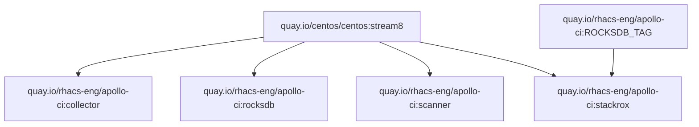
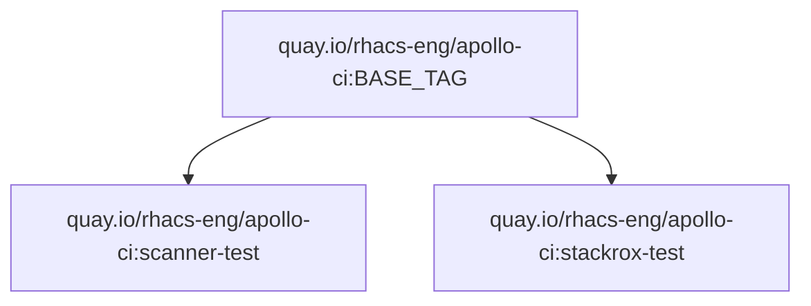
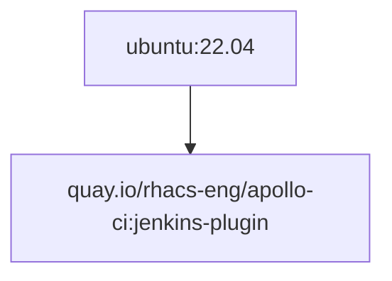

StackRox Container Images for CI Workflows
------------------------------------------

* https://github.com/stackrox/rox-ci-image/
* https://github.com/stackrox/rox-ci-image/actions
* https://app.circleci.com/pipelines/github/stackrox/rox-ci-image
* https://quay.io/repository/rhacs-eng/apollo-ci

Image Hierarchy
---------------

### Images based on //config/CENTOS\_TAG

### Images based on apollo-ci:BASE\_TAG

See build-and-push-image.sh, _BASE_TAG_ is the current tag for the apollo-ci variant.

### Images based on ubuntu:22.04

